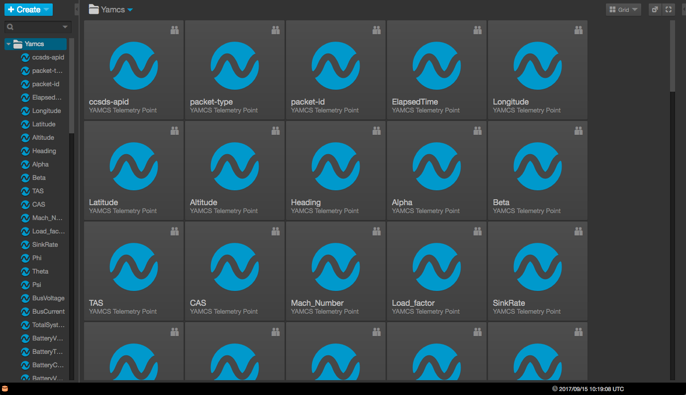
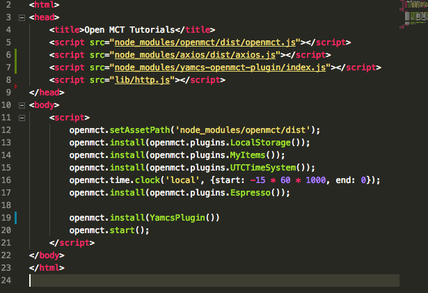

# :rocket: yamcs-openmct-plugin :rocket:

######  Yamcs-openmct-plugin allows users of the OpenMCT project to use data from Yamcs in their application. 



---
## Installation


## 1 - Installing Yamcs, Docker and Yamcs Studio

Before running your application, you will need to install some tools that this plugin will consume in order to get the respective telemetry. Follow this [tutorial](http://www.yamcs.org/running/) to get your tools up and running, and feel free to submit any questions at this repository if you've got any problems setting up the initial build.

## 2 - Install Yamcs-OpenMCT-Plugin

Secondly, one needs to add the plugin to your application in order to get the telemetry data. You can install the plugin through [`yarn`](https://yarnpkg.com/lang/en/) or [`npm`](https://www.npmjs.com/)

```sh
$ npm install yamcs-openmct-plugin
$ yarn add yamcs-openmct-plugin
```

If this fails, you could download this repository directly and import the plugin through a `script` tag as shown in step 3. 

## 3 - Add YamcsPlugin to your Application

To integrate `Yamcs-OpenMCT-Plugin` into your application, add an import to where you installed your plugin as shown at `Line7`. If you didn't download thorugh `Yarn` or `Npm`, you will need to change the script tag to match where the `index.js` file is. 

After importing the plugin in your application, you will get a function named `YamcsPlugin` available in your scope. This function is the initializer.



## 4 - Configuring the plugin

If you want to, you can configure the plugin as follows:

```js
openmct.install(YamcsPlugin{
  url: 'https://localhost:3000',
  }
)
```
